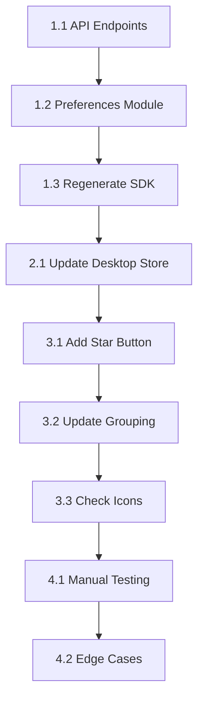

# PLAN-130: Add Favorite Models Support to Desktop Model Picker

**Issue:** [#130](https://github.com/Latitudes-Dev/shuvcode/issues/130)  
**Created:** 2025-06-13  
**Status:** Planning

---

## Problem Summary

The desktop web UI lacks the ability to mark models as favorites and have them pinned at the top of the model picker list. The TUI already has this functionality and stores favorites in `~/.local/state/opencode/model.json`, but the desktop UI only tracks recent models in browser localStorage.

**Goal:** Enable users to star/favorite models from the desktop model picker, with favorites persisting across sessions and syncing with the TUI.

---

## Technical Analysis

### Current TUI Implementation

The TUI stores model preferences in a JSON file at `~/.local/state/opencode/model.json`:

```json
{
  "recent": [{ "providerID": "anthropic", "modelID": "claude-sonnet-4-20250514" }],
  "favorite": [{ "providerID": "anthropic", "modelID": "claude-sonnet-4-20250514" }]
}
```

**Key TUI Code:**

- `packages/opencode/src/cli/cmd/tui/context/local.tsx:105-313`
  - Model store definition: lines 106-128
  - File path: `path.join(Global.Path.state, "model.json")` (line 130)
  - `save()` function: lines 132-140
  - `favorite()` getter: line 213
  - `toggleFavorite()`: lines 292-311
  - `cycleFavorite()`: lines 243-271

### Current Desktop Implementation

The desktop uses browser localStorage with only `recent` tracking:

**Key Desktop Code:**

- `packages/desktop/src/context/local.tsx:110-215`
  - Model store: lines 111-117 (missing `favorite` array)
  - localStorage read: line 119
  - localStorage write: lines 121-123
  - No `favorite()` or `toggleFavorite()` methods

### Architecture Decision

Since the browser cannot directly access the filesystem (`~/.local/state/`), we need a server-side API to enable the desktop to read/write model preferences to the same `model.json` file used by the TUI.

---

## Implementation Plan

### Milestone 1: Backend API Endpoints

Add new API endpoints to the opencode server for model preferences.

#### Task 1.1: Create Model Preferences API

- [ ] Add `GET /model/preferences` endpoint
- [ ] Add `POST /model/preferences` endpoint
- [ ] Define Zod schemas for request/response validation

**File:** `packages/opencode/src/server/server.ts`

**Reference endpoint pattern (config endpoints at lines 360-406):**

```typescript
// Add after line 541 (after /path endpoint)
.get(
  "/model/preferences",
  describeRoute({
    summary: "Get model preferences",
    description: "Retrieve model preferences including recent and favorite models.",
    operationId: "model.preferences.get",
    responses: {
      200: {
        description: "Model preferences",
        content: {
          "application/json": {
            schema: resolver(
              z.object({
                recent: z.array(z.object({
                  providerID: z.string(),
                  modelID: z.string(),
                })),
                favorite: z.array(z.object({
                  providerID: z.string(),
                  modelID: z.string(),
                })),
              }).meta({ ref: "ModelPreferences" })
            ),
          },
        },
      },
    },
  }),
  async (c) => {
    const preferences = await ModelPreferences.get()
    return c.json(preferences)
  },
)
.post(
  "/model/preferences",
  describeRoute({
    summary: "Update model preferences",
    description: "Update model preferences including recent and favorite models.",
    operationId: "model.preferences.update",
    responses: {
      200: {
        description: "Successfully updated preferences",
        content: {
          "application/json": {
            schema: resolver(z.boolean()),
          },
        },
      },
      ...errors(400),
    },
  }),
  validator("json", z.object({
    recent: z.array(z.object({
      providerID: z.string(),
      modelID: z.string(),
    })).optional(),
    favorite: z.array(z.object({
      providerID: z.string(),
      modelID: z.string(),
    })).optional(),
  })),
  async (c) => {
    const body = c.req.valid("json")
    await ModelPreferences.update(body)
    return c.json(true)
  },
)
```

#### Task 1.2: Create Model Preferences Module

- [ ] Create `packages/opencode/src/model/preferences.ts` module
- [ ] Implement file read/write operations for `model.json`
- [ ] Export `get()` and `update()` functions

**New File:** `packages/opencode/src/model/preferences.ts`

```typescript
import path from "path"
import { Global } from "@/global"

export namespace ModelPreferences {
  export interface ModelKey {
    providerID: string
    modelID: string
  }

  export interface Preferences {
    recent: ModelKey[]
    favorite: ModelKey[]
  }

  const file = Bun.file(path.join(Global.Path.state, "model.json"))

  export async function get(): Promise<Preferences> {
    try {
      const data = await file.json()
      return {
        recent: Array.isArray(data.recent) ? data.recent : [],
        favorite: Array.isArray(data.favorite) ? data.favorite : [],
      }
    } catch {
      return { recent: [], favorite: [] }
    }
  }

  export async function update(preferences: Partial<Preferences>): Promise<void> {
    const current = await get()
    const updated = {
      recent: preferences.recent ?? current.recent,
      favorite: preferences.favorite ?? current.favorite,
    }
    await Bun.write(file, JSON.stringify(updated))
  }
}
```

#### Task 1.3: Regenerate SDK Client

- [ ] Run SDK generation script to create new client methods
- [ ] Verify new methods are available in `packages/sdk/js/src/v2/gen/sdk.gen.ts`

**Command:**

```bash
cd packages/opencode && bun run script/generate-sdk.ts
```

---

### Milestone 2: Desktop Context Updates

Update the desktop local context to support favorites.

#### Task 2.1: Update Model Store Interface

- [ ] Add `favorite` array to model store state
- [ ] Add `favorite()` getter method
- [ ] Add `toggleFavorite()` method
- [ ] Add `isFavorite()` helper method

**File:** `packages/desktop/src/context/local.tsx`

**Changes to lines 110-215:**

```typescript
const model = (() => {
  const [store, setStore] = createStore<{
    model: Record<string, ModelKey>
    recent: ModelKey[]
    favorite: ModelKey[] // Add this
  }>({
    model: {},
    recent: [],
    favorite: [], // Add this
  })

  // Load from localStorage (recent only, for backwards compatibility)
  const value = localStorage.getItem("model")
  setStore("recent", JSON.parse(value ?? "[]"))

  // Sync favorites from server on mount
  sdk.client.model.preferencesGet().then((result) => {
    if (result.data?.favorite) {
      setStore("favorite", result.data.favorite)
    }
  })

  createEffect(() => {
    localStorage.setItem("model", JSON.stringify(store.recent))
  })

  // ... existing code ...

  const favorite = createMemo(() => store.favorite.map(find).filter(Boolean))

  const isFavorite = (key: ModelKey) =>
    store.favorite.some((x) => x.providerID === key.providerID && x.modelID === key.modelID)

  const toggleFavorite = async (model: ModelKey) => {
    if (!isModelValid(model)) return

    const exists = store.favorite.some((x) => x.providerID === model.providerID && x.modelID === model.modelID)
    const next = exists
      ? store.favorite.filter((x) => x.providerID !== model.providerID || x.modelID !== model.modelID)
      : [model, ...store.favorite]

    setStore("favorite", next)

    // Sync to server
    await sdk.client.model.preferencesUpdate({
      body: { favorite: next },
    })
  }

  return {
    current: currentModel,
    recent,
    favorite, // Add this
    isFavorite, // Add this
    toggleFavorite, // Add this
    list,
    cycle,
    set(model: ModelKey | undefined, options?: { recent?: boolean }) {
      // ... existing code ...
    },
  }
})()
```

---

### Milestone 3: Model Picker UI Updates

Add favorite toggle functionality and visual indicators to the model picker.

#### Task 3.1: Add Star Icon Button to Model List Items

- [ ] Import `IconButton` component
- [ ] Add star/star-filled icon button to each model row
- [ ] Handle click to toggle favorite status

**File:** `packages/desktop/src/components/prompt-input.tsx`

**Changes to lines 757-768 (inside SelectDialog children):**

```tsx
{
  ;(i) => (
    <div class="w-full flex items-center gap-x-2.5">
      <IconButton
        icon={local.model.isFavorite({ providerID: i.provider.id, modelID: i.id }) ? "star-filled" : "star"}
        variant="ghost"
        size="small"
        onClick={(e) => {
          e.stopPropagation()
          local.model.toggleFavorite({ providerID: i.provider.id, modelID: i.id })
        }}
        class="text-icon-warning-base hover:text-icon-warning-base-hover"
      />
      <span>{i.name}</span>
      <Show when={i.provider.id === "opencode" && (!i.cost || i.cost?.input === 0)}>
        <Tag>Free</Tag>
      </Show>
      <Show when={i.latest}>
        <Tag>Latest</Tag>
      </Show>
    </div>
  )
}
```

#### Task 3.2: Update Model Picker Grouping

- [ ] Modify `groupBy` to create "Favorites" group for favorited models
- [ ] Update `sortGroupsBy` to ensure Favorites appear first

**File:** `packages/desktop/src/components/prompt-input.tsx`

**Changes to lines 729-740:**

```tsx
groupBy={(x) => {
  if (local.model.isFavorite({ providerID: x.provider.id, modelID: x.id })) {
    return "Favorites"
  }
  return x.provider.name
}}
sortGroupsBy={(a, b) => {
  // Favorites always first
  if (a.category === "Favorites" && b.category !== "Favorites") return -1
  if (b.category === "Favorites" && a.category !== "Favorites") return 1
  // Then Recent
  if (a.category === "Recent" && b.category !== "Recent") return -1
  if (b.category === "Recent" && a.category !== "Recent") return 1
  // Then by provider popularity
  const aProvider = a.items[0].provider.id
  const bProvider = b.items[0].provider.id
  if (popularProviders.includes(aProvider) && !popularProviders.includes(bProvider)) return -1
  if (!popularProviders.includes(aProvider) && popularProviders.includes(bProvider)) return 1
  return popularProviders.indexOf(aProvider) - popularProviders.indexOf(bProvider)
}}
```

#### Task 3.3: Add Star Icon to UI Package (if needed)

- [ ] Verify `star` and `star-filled` icons exist in icon set
- [ ] Add icons if missing

**Files to check:**

- `packages/ui/src/icons/` directory
- `packages/ui/src/components/icon.tsx`

---

### Milestone 4: Testing & Validation

#### Task 4.1: Manual Testing Checklist

- [ ] **Test 1:** Star a model in desktop UI, verify it appears in Favorites group
- [ ] **Test 2:** Unstar a model, verify it moves back to provider group
- [ ] **Test 3:** Verify favorites persist after page refresh
- [ ] **Test 4:** Open TUI, verify same favorites appear
- [ ] **Test 5:** Toggle favorite in TUI, refresh desktop, verify sync
- [ ] **Test 6:** Search/filter models, verify favorites stay in Favorites group
- [ ] **Test 7:** Test with no favorites (empty state)
- [ ] **Test 8:** Test toggling favorite on currently selected model

#### Task 4.2: Edge Cases to Verify

- [ ] Favorite a model, then disconnect its provider - verify graceful handling
- [ ] Corrupt `model.json` file - verify error handling and recovery
- [ ] Race condition: rapid toggling favorites

---

## Code References

### Internal Files

| File                                                  | Description                              |
| ----------------------------------------------------- | ---------------------------------------- |
| `packages/opencode/src/cli/cmd/tui/context/local.tsx` | TUI favorites implementation (reference) |
| `packages/opencode/src/server/server.ts`              | Server API routes                        |
| `packages/opencode/src/global/index.ts`               | Global paths including `state`           |
| `packages/desktop/src/context/local.tsx`              | Desktop model store                      |
| `packages/desktop/src/components/prompt-input.tsx`    | Model picker UI                          |
| `packages/ui/src/components/select-dialog.tsx`        | SelectDialog component                   |
| `packages/ui/src/components/list.tsx`                 | List component with groupBy support      |
| `packages/sdk/js/src/v2/client.ts`                    | SDK client factory                       |
| `packages/sdk/js/src/v2/gen/sdk.gen.ts`               | Generated SDK methods                    |

### External References

| Resource            | URL                                                 |
| ------------------- | --------------------------------------------------- |
| Hono OpenAPI docs   | https://github.com/honojs/hono                      |
| hey-api/openapi-ts  | https://github.com/hey-api/openapi-ts               |
| SolidJS createStore | https://www.solidjs.com/docs/latest/api#createstore |

---

## Data Models

### ModelKey

```typescript
interface ModelKey {
  providerID: string
  modelID: string
}
```

### ModelPreferences (Server)

```typescript
interface ModelPreferences {
  recent: ModelKey[]
  favorite: ModelKey[]
}
```

### Model Store (Desktop)

```typescript
interface ModelStore {
  model: Record<string, ModelKey> // Per-agent current model
  recent: ModelKey[] // Recently used models
  favorite: ModelKey[] // Favorited models (NEW)
}
```

---

## API Specification

### GET /model/preferences

**Response:**

```json
{
  "recent": [{ "providerID": "anthropic", "modelID": "claude-sonnet-4-20250514" }],
  "favorite": [{ "providerID": "openai", "modelID": "gpt-4o" }]
}
```

### POST /model/preferences

**Request Body:**

```json
{
  "favorite": [
    { "providerID": "anthropic", "modelID": "claude-sonnet-4-20250514" },
    { "providerID": "openai", "modelID": "gpt-4o" }
  ]
}
```

**Response:**

```json
true
```

---

## Implementation Order



**Estimated Timeline:**

- Milestone 1 (Backend): ~2 hours
- Milestone 2 (Desktop Context): ~1 hour
- Milestone 3 (UI): ~2 hours
- Milestone 4 (Testing): ~1 hour

**Total: ~6 hours**

---

## Acceptance Criteria Checklist

From GitHub Issue #130:

- [ ] Favorite models appear in a "Favorites" group at the top of the model picker list
- [ ] Users can toggle favorite status on models via a star/heart icon in the model picker
- [ ] Favorites persist across sessions
- [ ] Desktop shares the same favorites data as the TUI (`~/.local/state/opencode/model.json`)
- [ ] Favorites remain at top regardless of search/filter state
- [ ] Visual indicator shows which models are favorited

---

## Notes

- The TUI uses `toggleFavorite` synchronously with `batch()` for state updates - desktop should follow similar pattern but use async for API calls
- Consider debouncing API calls if users rapidly toggle favorites
- The `cycleFavorite` TUI feature (keybind: `model_cycle_favorite`) is out of scope for this issue but could be added to desktop later
- localStorage remains as a backup/cache for `recent` models for backwards compatibility
